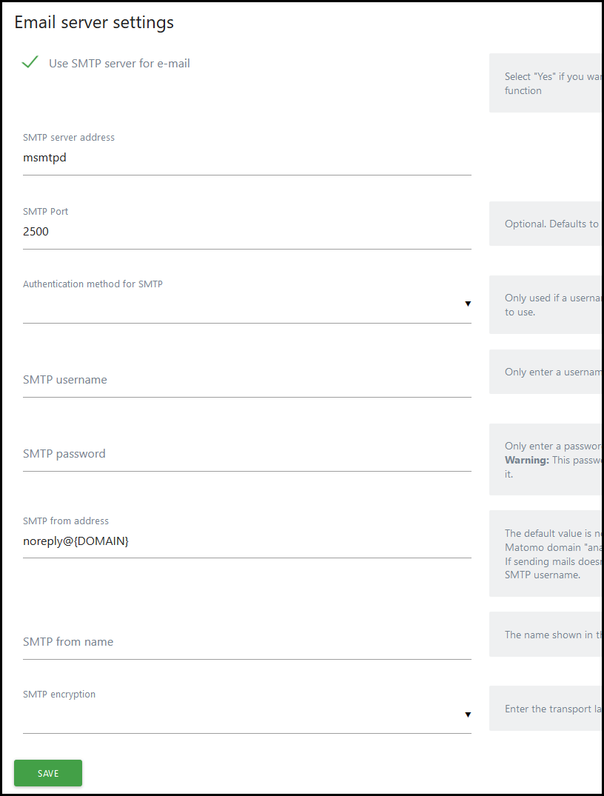
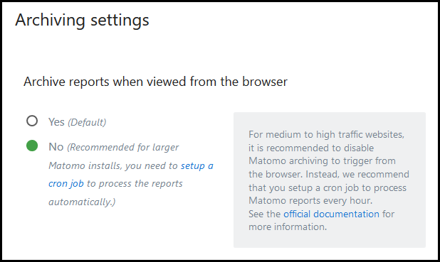
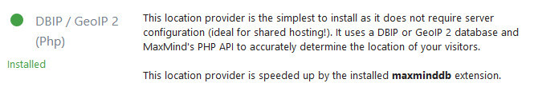

<p align="center"><a href="https://github.com/crazy-max/docker-matomo" target="_blank"></a></p>

<p align="center">
  <a href="https://hub.docker.com/r/crazymax/matomo/tags?page=1&ordering=last_updated"></a>
  <a href="https://github.com/crazy-max/docker-matomo/actions?workflow=build"></a>
  <a href="https://hub.docker.com/r/crazymax/matomo/"></a>
  <a href="https://hub.docker.com/r/crazymax/matomo/"></a>
  <br /><a href="https://github.com/sponsors/crazy-max"></a>
  <a href="https://www.paypal.me/crazyws"></a>
</p>

## About

[Matomo](https://matomo.org/) (formerly Piwik) Docker image based on Alpine Linux and Nginx.<br />
If you are interested, [check out](https://hub.docker.com/r/crazymax/) my other Docker images!

💡 Want to be notified of new releases? Check out 🔔 [Diun (Docker Image Update Notifier)](https://github.com/crazy-max/diun) project!

___

* [Features](#features)
* [Build locally](#build-locally)
* [Image](#image)
* [Environment variables](#environment-variables)
* [Volumes](#volumes)
* [Ports](#ports)
* [Usage](#usage)
  * [Docker Compose](#docker-compose)
  * [Swarm](#swarm)
  * [Kubernetes](#kubernetes)
  * [Command line](#command-line)
* [Upgrade](#upgrade)
* [Notes](#notes)
  * [Console command](#console-command)
  * [Email server settings](#email-server-settings)
  * [Sticky sessions](#sticky-sessions)
  * [Cron](#cron)
  * [GeoIP2](#geoip2)
  * [Behind a reverse proxy?](#behind-a-reverse-proxy)
  * [Redis cache](#redis-cache)
  * [Plugins](#plugins)
* [Contributing](#contributing)
* [License](#license)

## Features

* Run as non-root user
* Multi-platform image
* Config, plugins and user preferences in the same folder
* Unifont for languages using [unicode characters](https://matomo.org/faq/how-to-install/faq_142/)
* Cron tasks to archive Matomo reports as a ["sidecar" container](#cron)
* Ability to pass [additional options](https://matomo.org/docs/setup-auto-archiving/#help-for-corearchive-command) during cron archive
* Plugins and config are kept across upgrades of this image
* OPCache enabled to store precompiled script bytecode in shared memory
* Redis enabled and ready to enhance server performance
* [s6-overlay](https://github.com/just-containers/s6-overlay/) as process supervisor
* [Traefik](https://github.com/containous/traefik-library-image) as reverse proxy and creation/renewal of Let's Encrypt certificates (see [this template](examples/traefik))
* [msmtpd SMTP relay](https://github.com/crazy-max/docker-msmtpd) image to send emails
* [Redis](https://github.com/docker-library/redis) Docker image ready to use as [Redis cache](https://matomo.org/faq/how-to/faq_20511/) or [QueuedTracking plugin](https://matomo.org/faq/how-to/faq_19738) for better scalability
* [MariaDB](https://github.com/docker-library/mariadb) Docker image as database instance
* [geoip-updater](https://github.com/crazy-max/geoip-updater) Docker image to download MaxMind's GeoIP2 databases on a time-based schedule for geolocation
* Cron jobs as a ["sidecar" container](#cron)

## Build locally

```shell
git clone https://github.com/crazy-max/docker-matomo.git
cd docker-matomo

# Build image and output to docker (default)
docker buildx bake

# Build multi-platform image
docker buildx bake image-all
```

## Image

| Registry                                                                                         | Image                           |
|--------------------------------------------------------------------------------------------------|---------------------------------|
| [Docker Hub](https://hub.docker.com/r/crazymax/matomo/)                                            | `crazymax/matomo`                 |
| [GitHub Container Registry](https://github.com/users/crazy-max/packages/container/package/matomo)  | `ghcr.io/crazy-max/matomo`        |

Following platforms for this image are available:

```
$ docker run --rm mplatform/mquery crazymax/matomo:latest
Image: crazymax/matomo:latest
 * Manifest List: Yes
 * Supported platforms:
   - linux/amd64
   - linux/arm/v6
   - linux/arm64
   - linux/386
   - linux/ppc64le
   - linux/s390x
```

## Environment variables

* `TZ`: The timezone assigned to the container (default `UTC`)
* `PUID`: Matomo user id (default `1000`)
* `PGID`: Matomo group id (default `1000`)
* `MEMORY_LIMIT`: PHP memory limit (default `256M`)
* `UPLOAD_MAX_SIZE`: Upload max size (default `16M`)
* `CLEAR_ENV`: Clear environment in FPM workers (default `yes`)
* `OPCACHE_MEM_SIZE`: PHP OpCache memory consumption (default `128`)
* `LISTEN_IPV6`: Enable IPv6 for Nginx (default `true`)
* `REAL_IP_FROM`: Trusted addresses that are known to send correct replacement addresses (default `0.0.0.0/32`)
* `REAL_IP_HEADER`: Request header field whose value will be used to replace the client address (default `X-Forwarded-For`)
* `LOG_IP_VAR`: Use another variable to retrieve the remote IP address for access [log_format](http://nginx.org/en/docs/http/ngx_http_log_module.html#log_format) on Nginx. (default `remote_addr`)
* `LOG_LEVEL`: [Log level](https://matomo.org/faq/troubleshooting/faq_115/) of Matomo UI (default `WARN`)
* `SHORTCODE_DOMAIN`: Domain that you use for [ShortcodeTracker plugin](https://plugins.matomo.org/shortcodetracker) (default `invalid`)

The following environment variables are only used if you run the container as ["sidecar" mode](#cron):

* `SIDECAR_CRON`: Set to `1` to enable sidecar cron mode (default `0`)
* `ARCHIVE_OPTIONS`: Pass [additional options](https://matomo.org/docs/setup-auto-archiving/#help-for-corearchive-command) during cron archive
* `CRON_ARCHIVE`: Periodically execute Matomo [archive](https://matomo.org/docs/setup-auto-archiving/#linuxunix-how-to-set-up-a-crontab-to-automatically-archive-the-reports) (disabled if empty ; ex `0 * * * *`)

## Volumes

* `/data`: Contains GeoIP2 databases, configuration, installed plugins (not core ones), tmp and user folders to store
your [custom logo](https://matomo.org/faq/new-to-piwik/faq_129/)

> :warning: Note that the volume should be owned by the user/group with the specified `PUID` and `PGID`. If you
> don't give the volume correct permissions, the container may not start.

## Ports

* `8000`: HTTP port

## Usage

### Docker Compose

Docker compose is the recommended way to run this image. Copy the content of folder [examples/compose](examples/compose)
in `/var/matomo/` on your host for example. Edit the compose and env files with your preferences and run the following
commands:

```shell
docker-compose up -d
docker-compose logs -f
# open your browser at http://localhost:8000
```

### Swarm

Deploy this image in your Swarm cluster. Detailed instructions [can be found here](examples/swarm).

### Kubernetes

Deploy this image in your kubernetes cluster. Detailed instructions [can be found here](examples/kubernetes).

### Command line

You can also use the following minimal command:

```shell
docker run -d -p 8000:8000 --name matomo \
  -v $(pwd)/data:/data \
  crazymax/matomo:latest
```

>:warning: You will need to have your own database server to connect to as this only runs Matomo.

## Upgrade

You can upgrade Matomo automatically through the UI, it works well. But I recommend to recreate the container
whenever I push an update:

```shell
docker-compose pull
docker-compose up -d
```

## Notes

### Console command

If you want to use the `console` command to perform common server operations, type:

```shell
docker-compose exec matomo console
```

### Email server settings

You can use our SMTP relay `msmtpd` service published on port `2500` and declared in our
[`docker-compose.yml`](examples/compose/docker-compose.yml):



### Sticky sessions

On a HA environment, **enable backend sticky sessions** on your load balancer.

### Cron

If you want to enable the cron job, you have to run a "sidecar" container like in the
[docker-compose file](examples/compose/docker-compose.yml) or run a simple container like this:

```bash
docker run -d --name matomo_cron \
  --env-file $(pwd)/matomo.env \
  --no-healthcheck \
  -e "SIDECAR_CRON=1" \
  -e "CRON_ARCHIVE=0 * * * *" \
  -e "ARCHIVE_OPTIONS=--concurrent-requests-per-website=3" \
  -v $(pwd)/data:/data \
  crazymax/matomo:latest
```

Then if you have enabled `CRON_ARCHIVE` to automatically archive the reports, you have to disable Matomo archiving
to trigger from the browser. Go to **System > General settings**:



### GeoIP2

This image already uses GeoIP2 databases of [MaxMind](https://www.maxmind.com/) with their PHP extension
and are updated with [geoip-updater](https://github.com/crazy-max/geoip-updater). You just have to install
and activate the [GeoIP 2 plugin](https://plugins.matomo.org/GeoIP2).

Also make sure to select **DBIP / GeoIP 2 (Php)** in **System > Geolocation**:



### Behind a reverse proxy?

If you are running Matomo [behind a reverse proxy](https://matomo.org/faq/how-to-install/faq_98/), add this to your
config.ini.php:

```
[General]
assume_secure_protocol = 1 # 0=http 1=https
proxy_client_headers[] = HTTP_X_FORWARDED_FOR
proxy_client_headers[] = HTTP_X_REAL_IP
proxy_host_headers[] = HTTP_X_FORWARDED_HOST
```

### Redis cache

To use [Redis as a cache](https://matomo.org/faq/how-to/faq_20511/) (useful if your Matomo environment consists of
multiple servers), add this to your config.ini.php:

```
[Cache]
backend = chained

[ChainedCache]
backends[] = array
backends[] = redis

[RedisCache]
host = "redis" # Docker service name for Redis 
port = 6379
timeout = 0.0
password = ""
database = 14
```

In case you are using queued tracking: Make sure to configure a different database! Otherwise queued requests will
be flushed.

### Plugins

If you are on a [HA environment](https://matomo.org/faq/new-to-piwik/faq_134/), there is no need to set
`multi_server_environment = 1` in your config.

## Contributing

Want to contribute? Awesome! The most basic way to show your support is to star the project, or to raise issues. You
can also support this project by [**becoming a sponsor on GitHub**](https://github.com/sponsors/crazy-max) or by making
a [Paypal donation](https://www.paypal.me/crazyws) to ensure this journey continues indefinitely!

Thanks again for your support, it is much appreciated! :pray:

## License

MIT. See `LICENSE` for more details.
