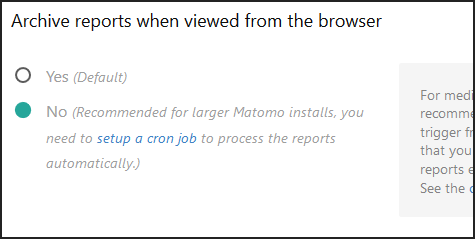
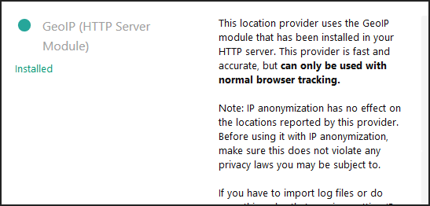

<p align="center"><a href="https://github.com/crazy-max/docker-matomo" target="_blank"></a></p>

<p align="center">
  <a href="https://microbadger.com/images/crazymax/matomo"></a>
  <a href="https://travis-ci.org/crazy-max/docker-matomo"></a>
  <a href="https://hub.docker.com/r/crazymax/matomo/"></a>
  <a href="https://hub.docker.com/r/crazymax/matomo/"></a>
  <a href="https://quay.io/repository/crazymax/matomo"></a>
  <a href="https://www.paypal.com/cgi-bin/webscr?cmd=_s-xclick&hosted_button_id=JP85E7WHT33FL"></a>
</p>

## About

🐳 [Matomo](https://matomo.org/) (formerly Piwik) Docker image based on Alpine Linux and Nginx.<br />
If you are interested, [check out](https://hub.docker.com/r/crazymax/) my other 🐳 Docker images!

## Features

### Included

* Alpine Linux 3.8, Nginx, PHP 7.2
* Tarball authenticity checked during building process
* Config, plugins and user preferences in the same folder
* GeoLite data created by [MaxMind](http://www.maxmind.com) for geolocation
* Cron tasks to archive Matomo reports and update GeoLite data as a ["sidecar" container](#cron)
* Ability to pass [additional options](https://matomo.org/docs/setup-auto-archiving/#help-for-corearchive-command) during cron archive
* Plugins and config are kept across upgrades of this image
* [SSMTP](https://linux.die.net/man/8/ssmtp) for SMTP relay to send emails
* OPCache enabled to store precompiled script bytecode in shared memory
* Redis enabled and ready to enhance server performance

### From docker-compose

* [Traefik](https://github.com/containous/traefik-library-image) as reverse proxy and creation/renewal of Let's Encrypt certificates
* [Redis](https://github.com/docker-library/redis) image ready to use as [Redis cache](https://matomo.org/faq/how-to/faq_20511/) or [QueuedTracking plugin](https://matomo.org/faq/how-to/faq_19738) for better scalability
* [MariaDB](https://github.com/docker-library/mariadb) image as database instance
* Cron jobs as a ["sidecar" container](#cron)

## Docker

### Environment variables

* `TZ` : The timezone assigned to the container (default: `UTC`)
* `MEMORY_LIMIT` : PHP memory limit (default: `256M`)
* `UPLOAD_MAX_SIZE` : Upload max size (default: `16M`)
* `OPCACHE_MEM_SIZE` : PHP OpCache memory consumption (default: `128`)
* `LOG_LEVEL` : [Log level](https://matomo.org/faq/troubleshooting/faq_115/) of Matomo UI (default: `WARN`)
* `SIDECAR_CRON` : Mark the container as a sidecar cron job (default: `0`)
* `SSMTP_HOST` : SMTP server host
* `SSMTP_PORT` : SMTP server port (default: `25`)
* `SSMTP_HOSTNAME` : Full hostname (default: `$(hostname -f)`)
* `SSMTP_USER` : SMTP username
* `SSMTP_PASSWORD` : SMTP password
* `SSMTP_TLS` : SSL/TLS (default: `NO`)

The following environment variables are only used if you run the container as ["sidecar" mode](#cron) :

* `ARCHIVE_OPTIONS` : Pass [additional options](https://matomo.org/docs/setup-auto-archiving/#help-for-corearchive-command) during cron archive
* `CRON_GEOIP` : Periodically update GeoIP data (disabled if empty ; ex `0 4 * * *`)
* `CRON_ARCHIVE` : Periodically execute Matomo [archive](https://matomo.org/docs/setup-auto-archiving/#linuxunix-how-to-set-up-a-crontab-to-automatically-archive-the-reports) (disabled if empty ; ex `0 * * * *`)

### Volumes

* `/data` : Contains GeoIP databases, configuration, installed plugins (not core ones), tmp and user folders to store your [custom logo](https://matomo.org/faq/new-to-piwik/faq_129/)

### Ports

* `80` : HTTP port

## Use this image

### Docker Compose

Docker compose is the recommended way to run this image. Copy the content of folder [examples/compose](examples/compose) in `/var/matomo/` on your host for example. Edit the compose and env files with your preferences and run the following commands :

```bash
touch acme.json
chmod 600 acme.json
docker-compose up -d
docker-compose logs -f
```

### Command line

You can also use the following minimal command :

```bash
docker run -d -p 80:80 --name matomo \
  -v $(pwd)/data:/data \
  crazymax/matomo:latest
```

## Notes

### Sticky sessions

On a HA environment, **enable backend sticky sessions** on your load balancer.

### Cron

If you want to enable the cron job, you have to run a "sidecar" container like in the [docker-compose file](examples/compose/docker-compose.yml) or run a simple container like this :

```bash
docker run -d --name matomo-cron \
  --env-file $(pwd)/matomo.env \
  -e "SIDECAR_CRON=1" \
  -e "CRON_ARCHIVE=0 * * * *" \
  -e "ARCHIVE_OPTIONS=--concurrent-requests-per-website=3" \
  -v $(pwd)/data:/data \
  crazymax/matomo:latest
```

Then if you have enabled `CRON_ARCHIVE` to automatically archive the reports, you have to disable Matomo archiving to trigger from the browser. Go to **System > General settings** :



### Change location provider

As GeoIP module for Nginx is installed and uses GeoIP data, you have to select **GeoIP (HTTP Server Module)** in **System > Geolocation** :



### Behind a reverse proxy ?

If you are running Matomo [behind a reverse proxy](https://matomo.org/faq/how-to-install/faq_98/), add this to your config.ini.php :

```
[General]
assume_secure_protocol = 1 # 0=http 1=https
proxy_client_headers[] = HTTP_X_FORWARDED_FOR
proxy_client_headers[] = HTTP_X_REAL_IP
proxy_host_headers[] = HTTP_X_FORWARDED_HOST
```

### Redis cache

To use [Redis as a cache](https://matomo.org/faq/how-to/faq_20511/) (useful if your Matomo environment consists of multiple servers), add this to your config.ini.php :

```
[Cache]
backend = chained

[ChainedCache]
backends[] = array
backends[] = redis

[RedisCache]
host = "redis" # Docker service name for Redis 
port = 6379
timeout = 0.0
password = ""
database = 14
```

In case you are using queued tracking: Make sure to configure a different database! Otherwise queued requests will be flushed.

### Plugins

If you are on a [HA environment](https://matomo.org/faq/new-to-piwik/faq_134/), there is no need to set `multi_server_environment = 1` in your config.<br />
[matomo_watch_plugins](assets/usr/local/bin/matomo_watch_plugins) script will take care of plugins synchronization from `/data/plugins/` to `/var/www/plugins/`.

## Upgrade

You can upgrade Matomo automatically through the UI, it works well. But I recommend to recreate the container whenever I push an update :

```bash
docker-compose pull
docker-compose up -d
```

## How can I help ?

All kinds of contributions are welcome :raised_hands:!<br />
The most basic way to show your support is to star :star2: the project, or to raise issues :speech_balloon:<br />
But we're not gonna lie to each other, I'd rather you buy me a beer or two :beers:!

[](https://www.paypal.com/cgi-bin/webscr?cmd=_s-xclick&hosted_button_id=JP85E7WHT33FL)

## License

MIT. See `LICENSE` for more details.
